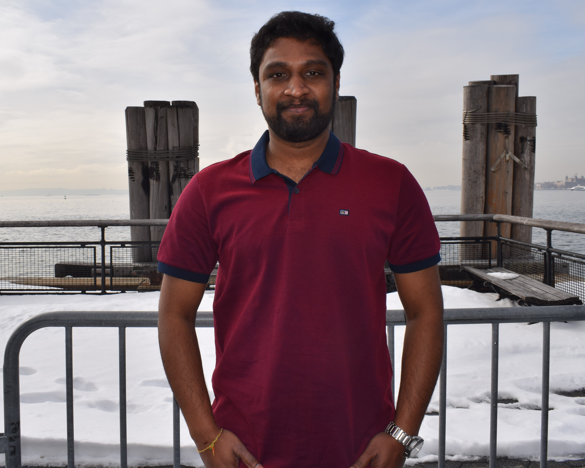

# 
 RAJESH SWARNA 

  

<!--   -->

 

# My Computer Experience:
### Completed my undergrad in Computer Science and worked as a Software developer for 2+ years on different technologies (.Net, Sitecore CMS, Apache Solr, Dynamics 365 CRM) but mostly on .Net

 

# How this course helps in Future:

### I want to learn end to end web application development from very basic level so I believe this course will definitely help me in achieving it and I am waiting for an idea to strike in my head so that I can work on it with my complete focus and dedication😋

### I would like to mention one thing about me I know if some requirement comes to me I will definitely accomplish it but in the process of fulfilling it I forget to know how that is accomplished (I will try different codes from online). I want to change that part of me.
